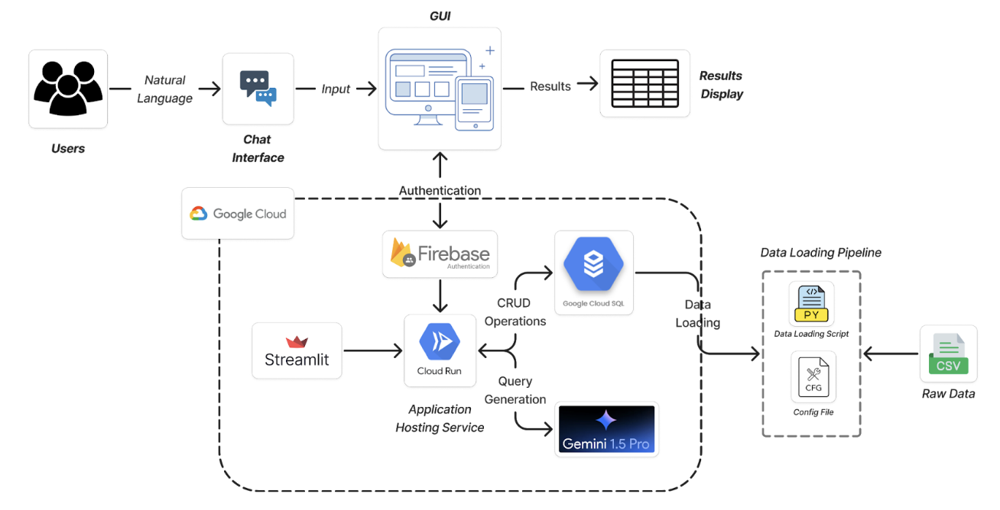

# **Natural Language Query Builder (talk-to-db)**

## Repository Overview
The repository **talk-to-db** contains code for the streamlit web application that performs SQL database operations using natural language, powered by the Gemini 1.5 Pro flash model.

---

## **Table of Contents**
1. [Project Overview](#1-project-overview)
2. [Workflow](#2-workflow)
3. [Key Features](#3-key-features)
4. [Technologies Used](#4-technologies-used)
5. [Setup Instructions](#5-setup-instructions)
6. [Future Enhancements](#6-future-enhancements)
7. [Acknowledgements](#7-acknowledgements)

---

## **1. Project Overview**

This project demonstrates an AI-powered, cloud-hosted chat application that integrates multiple components for efficiency and scalability.

### **Core Components**
- **Frontend**: A Streamlit-based graphical user interface for easy interaction.
- **Authentication**: User login and session management through **Firebase Authentication**.
- **Backend**: Hosted on **Google Cloud Run** to handle requests and process queries.
- **AI Model**: Integrated **Gemini 1.5 Pro AI model** for real-time, context-aware query handling.
- **Database**: **Google Cloud SQL** for structured data storage and retrieval.
- **Data Pipeline**: Automated ingestion and preprocessing of raw data in CSV format.

---

## **2. Workflow**

### **System Architecture**


### **Step-by-Step Workflow**
1. **User Interaction via Chat Interface**:
   - Users interact through a **Streamlit-based GUI**, inputting natural language queries and receiving results dynamically.

2. **Secure Authentication**:
   - Managed by **Firebase Authentication** to ensure only verified users can access the system.

3. **Backend Query Processing**:
   - The backend, hosted on **Google Cloud Run**, processes user inputs:
     - Retrieves or updates data in **Google Cloud SQL**.
     - Sends queries to the **Gemini 1.5 Pro AI model** for computation and response generation.

4. **AI-Driven Insights**:
   - The **Gemini 1.5 Pro AI model** generates relevant, insightful, and context-aware responses in real-time.

5. **Data Loading Pipeline**:
   - Raw data in CSV format is ingested, cleaned, and stored in the database:
     - **Python scripts** handle preprocessing.
     - **Configuration files** manage pipeline execution.

6. **Result Display**:
   - Processed results are sent back to the Streamlit interface, where users can view them in an intuitive format.

---

## **3. Key Features**
- **Interactive Chat Interface**:
  - Built using Streamlit for dynamic input and output display.
- **Secure Authentication**:
  - Handled by Firebase to ensure user security and session management.
- **AI-Powered Query Handling**:
  - Leverages the **Gemini 1.5 Pro AI model** for accurate and insightful responses.
- **Cloud-Hosted Backend**:
  - Scalable and resilient infrastructure on Google Cloud Run.
- **Robust Data Pipeline**:
  - Automated ingestion and preprocessing of raw data for backend use.

---

## **4. Technologies Used**
- **Frontend**: Streamlit
- **Authentication**: Firebase Authentication
- **Backend**: Google Cloud Run
- **AI**: Gemini 1.5 Pro AI Model
- **Database**: Google Cloud SQL
- **Data Pipeline**: Python, CSV-based data ingestion
- **Cloud Services**: Google Cloud (Run, SQL)

---

## **5. Setup Instructions**

### Prerequisites
- Python 3.8 or higher installed
- Google Cloud SDK installed and authenticated
- Access to the Google Cloud project containing your Cloud SQL instance
- Firebase project with Authentication configured

### Installation Steps

1. **Clone the Repository**
   ```bash
   git clone <repository-url>
   cd talk-to-db
   ```

2. **Set Up Virtual Environment**

   - **Linux/MacOS:**
     ```bash
     python3 -m venv talk2db
     source talk2db/bin/activate
     ```

   - **Windows:**
     ```bash
     python -m venv talk2db
     talk2db\Scripts\activate
     ```

3. **Install Dependencies**
   ```bash
   pip install -r requirements.txt
   ```

4. **Insert Environment Variables**
   Create a `.env` file in the root of the project and populate it with the following variables:
   ```env
   LOCATION=<Your Cloud Region>
   PROJECT_ID=<Your Google Cloud Project ID>
   MODEL_NAME=<Name of the Gemini 1.5 Pro Model>
   CLOUDSQL_IP=<Cloud SQL Instance IP Address>
   DATABASE_NAME=<Your Database Name>
   PORT=<Database Port, e.g., 3306>
   PASSWORD=<Your Database Password>
   FB_API_KEY=<FB_API_KEY>
   FB_AUTH_DOMAIN=<FB_AUTH_DOMAIN>
   FB_DB_URL=<FB_DB_URL>
   FB_PROJECT_ID=<FB_PROJECT>
   FB_STORAGE_BUCKET=<FB_STORAGE_BUCKET>
   FB_MSG_SENDER_ID=<FB_MSG_SENDER_ID>
   FB_APP_ID=<FB_APP_ID>
   FB_MEASUREMENT_ID=<FB_MEASUREMENT_ID>
   ```

5. **Set Up Cloud SQL Proxy**
   Follow the instructions at [Google Cloud SQL Proxy Documentation](https://cloud.google.com/sql/docs/mysql/connect-instance-auth-proxy) to download and start the Cloud SQL Auth Proxy.

   Example:
   ```bash
   ./cloud-sql-proxy <INSTANCE_CONNECTION_NAME>
   ```

   - **Linux/MacOS:**
     ```bash
     ./cloud-sql-proxy <INSTANCE_CONNECTION_NAME>
     ```

   - **Windows:**
     ```cmd
     cloud-sql-proxy.exe <INSTANCE_CONNECTION_NAME>
     ```

6. **Run the Application**
   ```bash
   streamlit run main.py
   ```

---

## **6. Future Enhancements**
- Real-Time Data Monitoring: Integrate monitoring solutions like Google Cloud Monitoring for system performance insights.
- Enhanced AI Models: Upgrade to newer AI models for improved response accuracy.
- User Analytics: Implement analytics dashboards for tracking user interactions and system usage.

---

## **7. Acknowledgements**

- Team Members: [Surya Krishna Guthikonda](https://github.com/SuryaKrishna02) and [Anirudh Penmatcha](https://github.com/AnirudhPenmatcha)

